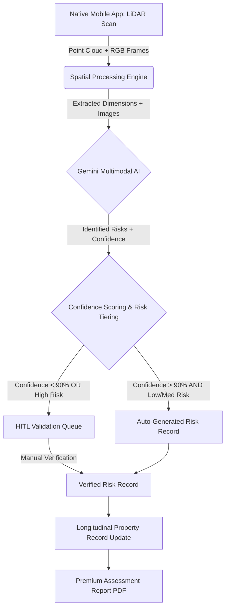

# AI Intelligence & Spatial Measurement Pipeline

As the **Specialized Worker in AI/ML Engineering, Computer Vision, and Mobile Development**, I have architected the **AI Intelligence & Spatial Measurement Pipeline** for HOMEase Solutions. 

To solve the "lethal product assumption" regarding measurement accuracy, this architecture moves away from browser-based estimation to a **Native LiDAR-First approach**. We leverage hardware-level depth sensing (ARKit/ARCore) for "Ground Truth" spatial data, combined with **Gemini Multimodal LLMs** for semantic risk identification.

---

### 1. High-Level Architectural Workflow: Capture → Assess → Report

The pipeline is designed as a four-stage process where physical reality is converted into structured, auditable risk records.



---

### 2. Native LiDAR API Integration Logic (iOS/Android)

To achieve sub-inch accuracy, we utilize the device's **Time-of-Flight (ToF)** sensors. The native app does not just take photos; it generates a semantic 3D mesh.

#### Pseudocode: Spatial Data Extraction (Swift/ARKit Example)
```swift
// Logic to extract specific ADA dimensions using LiDAR Mesh
class SpatialMeasurementEngine: NSObject, ARSessionDelegate {
    
    func processFrame(_ frame: ARFrame) {
        // 1. Obtain the scene depth and mesh anchors
        guard let meshAnchors = frame.anchors.compactMap({ $0 as? ARMeshAnchor }) else { return }
        
        for anchor in meshAnchors {
            // 2. Identify horizontal and vertical planes
            let geometry = anchor.geometry
            let vertices = geometry.vertices
            
            // 3. Logic for Doorway Width (Distance between two parallel vertical planes)
            let doorwayWidth = calculateClearWidth(from: vertices)
            
            // 4. Logic for Counter Height (Distance from floor plane to highest horizontal plane)
            let floorY = frame.anchors.compactMap({ $0 as? ARPlaneAnchor }).filter({ $0.alignment == .horizontal }).first?.transform.columns.3.y
            let counterHeight = abs(vertices.maxY - (floorY ?? 0))
            
            // 5. Package for AI Analysis
            let spatialMetadata = SpatialMetadata(
                doorwayWidth: doorwayWidth,
                counterHeight: counterHeight,
                accuracyTolerance: frame.camera.intrinsics // Calibration data
            )
            uploadToBackend(spatialMetadata, frame.capturedImage)
        }
    }
}
```

---

### 3. Gemini-Supported Image Analysis (ADA Gap Detection)

While LiDAR provides the *numbers*, Gemini provides the *context*. Gemini identifies if a 30-inch gap is a "closet" (low risk) or the "primary bathroom entrance" (high risk).

#### AI Inference Logic (Python/Fastify Backend)
```python
def analyze_accessibility_hazards(image_data, spatial_metadata):
    """
    Combines LiDAR Ground Truth with Gemini Multimodal Analysis
    """
    prompt = f"""
    Analyze this kitchen/bathroom image for ADA compliance.
    LIDAR DATA: 
    - Measured Doorway: {spatial_metadata['doorwayWidth']} inches
    - Measured Counter Height: {spatial_metadata['counterHeight']} inches
    
    TASK:
    1. Identify the object in the image.
    2. Compare measured dimensions against ADA standards (36" doorway, 34" counter).
    3. Identify 'Invisible Risks' like floor transitions or lack of knee clearance.
    4. Return a structured JSON RiskRecord.
    """
    
    # Call Gemini Pro Vision
    response = gemini_model.generate_content([prompt, image_data])
    risk_data = json.loads(response.text)
    
    # Calculate Final Confidence Score
    # Formula: (AI_Certainty * 0.4) + (LiDAR_Signal_Quality * 0.6)
    confidence = calculate_composite_confidence(risk_data['ai_certainty'], spatial_metadata['signal_quality'])
    
    return risk_data, confidence
```

---

### 4. Human-in-the-Loop (HITL) Validation Workflow

To mitigate the **"Material Ordering Liability,"** any measurement that could result in high-cost construction errors is gated.

#### HITL Gating Logic (Pseudocode)
```typescript
async function processRiskRecord(riskData: any, confidence: number) {
  const HIGH_RISK_KEYWORDS = ['structural', 'doorway_widening', 'load_bearing'];
  const CONFIDENCE_THRESHOLD = 0.90;

  // Determine if HITL is required
  const needsManualReview = 
    confidence < CONFIDENCE_THRESHOLD || 
    HIGH_RISK_KEYWORDS.some(k => riskData.description.includes(k)) ||
    riskData.severity === 'HIGH';

  if (needsManualReview) {
    // Route to Admin Review Dashboard (HITL Queue)
    await prisma.riskRecord.create({
      data: {
        ...riskData,
        status: 'PENDING_HITL_VERIFICATION',
        isVerified: false,
        aiConfidence: confidence
      }
    });
    notifyAdminTeam(riskData.id);
  } else {
    // Auto-verify low-risk items (e.g., grab bar placement)
    await prisma.riskRecord.create({
      data: {
        ...riskData,
        status: 'COMPLETED',
        isVerified: true,
        aiConfidence: confidence,
        verifiedAt: new Date()
      }
    });
  }
}
```

---

### 5. Technical Risk Mitigation Strategies

| Risk | Mitigation Logic |
| :--- | :--- |
| **Sub-inch Accuracy** | Use **ARKit SceneReconstruction** to create a 3D bounding box around doorways. If the LiDAR point cloud density is low (poor lighting), the app forces the user to re-scan before allowing an upload. |
| **Material Liability** | Implementation of a **"Confidence Interval"** in reports. Instead of saying "30 inches," the report states "30.1" +/- 0.2"." If the tolerance is > 0.5", HITL is mandatory. |
| **Stateless PDF Problem** | The AI-generated report includes **Dynamic QR Codes** linked to the `RiskRecord` in the database. Contractors must scan the code to "Check-in" to the project, ensuring the transaction stays on-platform. |

### 6. Integration with Data Modeling
The output of this pipeline directly populates the `RiskRecord` table defined in the **data_modeling** subtask. Specifically:
- `detectedDimension` is populated by the LiDAR engine.
- `aiConfidence` is the composite score from the AI Inference Logic.
- `isVerified` is toggled only after the HITL Gating Logic or an Admin override.

This architecture ensures that the **"Home Safety FICO"** is based on scientifically verifiable spatial data rather than subjective visual estimation.
