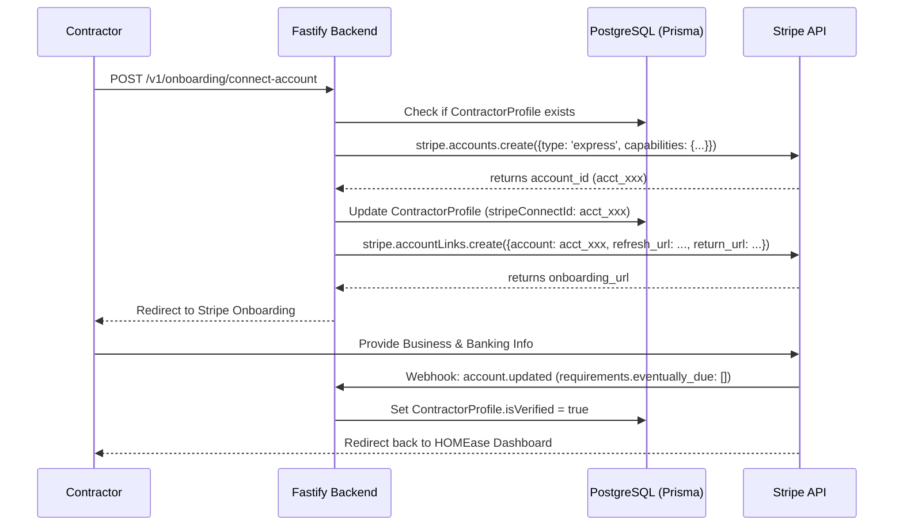
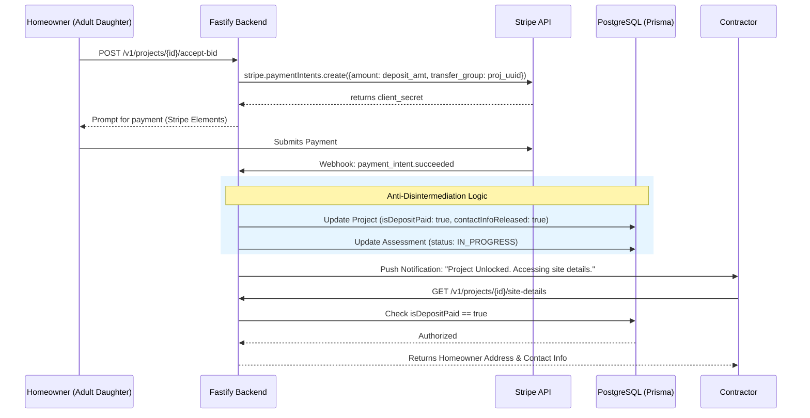
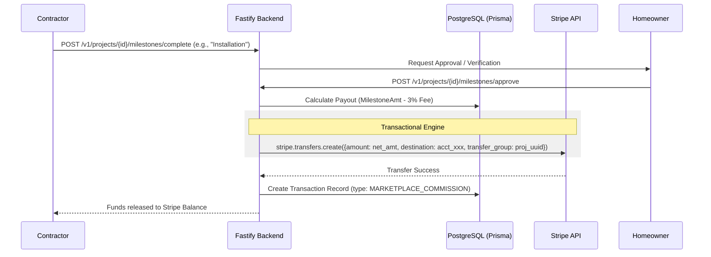

# Transactional Engine & Anti-Disintermediation Logic

As the **Specialized Worker in Fintech and Backend Architecture**, I have developed the transactional logic and anti-disintermediation engine for HOMEase Solutions. 

The primary challenge addressed here is the **"Transactional Trap"**: ensuring the platform captures its 3% fee on high-value projects (avg. $14,750) while preventing contractors from bypassing the system once a lead is generated. My solution utilizes **Stripe Connect (Express)** with a **Separate Charges and Transfers** workflow. This architecture allows the platform to act as a financial intermediary (escrow), withholding sensitive project data until financial commitment is verified.

---

### 1. Architectural Strategy: The "Financial Gate"

To enforce anti-disintermediation, we implement a "Stateful Marketplace." 
*   **The Gate:** The `Property.address` and `User.phone/email` are encrypted and inaccessible to the contractor profile until a `payment_intent.succeeded` event is received for the project deposit.
*   **The Escrow:** Funds are captured at the platform level. Transfers to the `ContractorConnectId` are only triggered by milestone completion events, ensuring the "Adult Daughter" (decision-maker) retains control.

---

### 2. Sequence Diagram: Contractor Onboarding
This flow ensures every contractor is KYC-verified and financially linked to the platform before they can view "Qualified Project Intelligence."



---

### 3. Sequence Diagram: Escrow & Anti-Disintermediation
This is the core logic that protects the 3% fee. The "Contact Info" is the hostage; the "Deposit" is the release.



---

### 4. Sequence Diagram: Milestone-Based Payout Triggers
Logic for the 3% marketplace fee and structured release of funds.



---

### 5. API Endpoint Definitions & Webhook Logic

#### A. Stripe Webhook Handler (`/v1/webhooks/stripe`)
The "Source of Truth" for the financial state of the project.

| Event | Logic |
| :--- | :--- |
| `payment_intent.succeeded` | 1. Identify `project_id` via `metadata`. <br> 2. Set `Project.isDepositPaid = true`. <br> 3. Set `Project.contactInfoReleased = true`. <br> 4. Trigger "Welcome" email to Homeowner and "Unlocked" notification to Contractor. |
| `account.updated` | 1. Check `charges_enabled` and `payouts_enabled`. <br> 2. Update `ContractorProfile.status` to 'ACTIVE'. |
| `transfer.created` | 1. Log `Transaction` record in DB. <br> 2. Update `Project.totalPaidToDate`. |

#### B. Payout Calculation Logic (Backend Service)
This internal function handles the 3% marketplace fee deduction.

```typescript
/**
 * Logic for calculating the 3% marketplace fee and net contractor payout.
 * Implemented within the Fastify service layer.
 */
async function calculateMilestonePayout(projectId: string, milestoneAmount: number) {
  const PLATFORM_FEE_PERCENT = 0.03;
  
  const platformFee = Math.round(milestoneAmount * PLATFORM_FEE_PERCENT);
  const netContractorAmount = milestoneAmount - platformFee;

  return {
    total: milestoneAmount,
    fee: platformFee, // HOMEase Revenue
    payout: netContractorAmount // Contractor Revenue
  };
}
```

---

### 6. Critical Technical Safeguards

1.  **Idempotency Keys:** Every Stripe transfer request uses the `ProjectID_MilestoneName` as an idempotency key to prevent double-payouts in the event of network retries.
2.  **Transfer Groups:** All transactions related to a single "Safety FICO" modification project are tagged with a `transfer_group` (the `project_uuid`). This allows for clean financial auditing and simplified refund logic if a project is cancelled post-demolition.
3.  **The "Certification" Gate:** The final 10% of the project value is programmatically locked until the **Post-Modification Assessment** is completed and the `isVerified` flag is set on the new `RiskRecord` set (referencing the `data_modeling` subtask). This ensures the contractor stays on-platform to complete the "Safety Score" loop.
4.  **Row-Level Security (RLS) Integration:** The `contactInfoReleased` boolean in my logic directly feeds the RLS policies defined in the database subtask, ensuring that even a direct API call to the `Property` table will return `null` for address fields if the deposit isn't confirmed.

This engine transforms HOMEase from a passive lead-gen site into a high-integrity financial platform, securing the 373% revenue lift identified in the strategic pivot.
