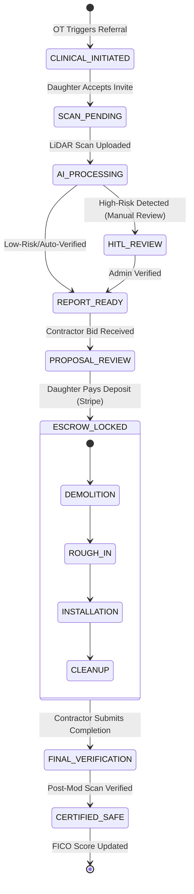

# Family Collaboration Portal & Clinical Handoff Logic

As the **Specialized Worker in Full-stack Development, UX Logic, and Healthcare Integration**, I have designed the logic for the **Family Collaboration Portal** and the **Clinical Handoff Pipeline**. 

My focus is on operationalizing the "Anxious Daughter" persona's need for transparency while ensuring the clinical handoff from hospital discharge planners is frictionless and HIPAA-compliant. This architecture bridges the gap between clinical recommendation and physical execution, utilizing a state-machine approach to ensure transactional integrity.

---

### 1. Clinical Handoff Logic: The "Zero-CAC" Entry Point

The clinical handoff is the primary engine for customer acquisition. We provide a specialized API and lightweight interface for Hospital Discharge Planners and Occupational Therapists (OTs).

#### Clinical Integration API Specification (Fastify/OpenAPI)
This API allows clinical partners to initiate the "Aging in Place" workflow without requiring them to manage the construction details.

| Endpoint | Method | Description | Primary Payload Keys |
| :--- | :--- | :--- | :--- |
| `/v1/clinical/referral` | `POST` | Initiates a new assessment request from a hospital/clinic. | `patientId`, `caregiverEmail` (Daughter), `clinicalPriority` (Urgent/Standard), `dischargeDate`. |
| `/v1/clinical/assessment/{id}` | `GET` | Allows the OT to view the status of the home safety scan. | `assessmentStatus`, `safetyScore`, `isHomeSafeForReturn`. |
| `/v1/clinical/invite-caregiver` | `POST` | Triggers the "Family Portal" invitation to the primary decision-maker. | `referralId`, `caregiverPhone`. |

**Security Note:** To maintain HIPAA compliance, the HOMEase database stores "Environmental Risk Records" linked to a `PropertyID`, while the `PatientID` is kept in a separate, encrypted clinical mapping table. No medical diagnoses are stored in the property record.

---

### 2. Family Collaboration Portal: State Machine Logic

The portal is the primary "Disintermediation Defense." By making the portal the **Source of Truth** for project progress, we ensure the contractor cannot bypass the platform without losing the trust of the "Anxious Daughter."

#### Project State Machine Diagram
This diagram defines the lifecycle of a project within the portal.



---

### 3. Visual Progress Tracker Logic (UX State Management)

To reduce the administrative burden on the contractor and provide "Trust and Control" to the daughter, the portal utilizes a **Reactive Milestone System**.

**Frontend Logic (React/TypeScript):**
```typescript
interface ProjectMilestone {
  id: string;
  label: string;
  status: 'LOCKED' | 'CURRENT' | 'COMPLETED';
  visualProofUrl?: string; // Photos uploaded by contractor
  timestamp?: Date;
}

// Logic to derive the "Visual Progress Tracker" UI state
const getTrackerState = (project: ProjectRecord): ProjectMilestone[] => {
  return [
    { label: 'Assessment', status: project.scanCompleted ? 'COMPLETED' : 'CURRENT' },
    { label: 'Funding', status: project.isDepositPaid ? 'COMPLETED' : project.scanCompleted ? 'CURRENT' : 'LOCKED' },
    { label: 'Construction', status: project.constructionStatus === 'FINISHED' ? 'COMPLETED' : project.isDepositPaid ? 'CURRENT' : 'LOCKED' },
    { label: 'Safety Certification', status: project.isCertified ? 'COMPLETED' : project.constructionStatus === 'FINISHED' ? 'CURRENT' : 'LOCKED' }
  ];
};
```

---

### 4. Home Safety FICO Score Calculation (The "Longevity Delta")

The "Home Safety FICO" is a dynamic score (300-850) that quantifies the risk level of the home. It is calculated based on the presence of hazards identified in the `ai_intelligence_layer`.

#### The Scoring Algorithm
The score is derived from a **Base Score (850)** minus the **Weighted Risk Penalty (WRP)**.

**Formula:**
$$Score_{current} = 850 - \sum (Risk_{i} \times Weight_{i})$$

| Risk Category | Weight (Penalty) | Example |
| :--- | :--- | :--- |
| **High Priority** | 100 points | Doorway < 32", No knee clearance under sink |
| **Medium Priority** | 45 points | Counter height > 36", Non-ADA toilet height |
| **Low Priority** | 15 points | Slippery floor texture, Poor lighting |

#### Logic for the "Safety Delta" (ROI for Insurers)
When a contractor completes a modification, a **Post-Modification Scan** is required. The "Longevity Delta" is the improvement in the score, which triggers the final escrow release and updates the Longitudinal Property Record.

```typescript
/**
 * Calculates the delta between pre-modification and post-modification safety.
 * This delta is the primary metric for Medicare Advantage/Insurance ROI.
 */
async function calculateSafetyFicoDelta(propertyId: string) {
  const preModScore = await prisma.safetyScore.findFirst({
    where: { propertyId, type: 'BASELINE' }
  });
  
  const postModScore = await generateCurrentScore(propertyId); // Recalculated from new scans
  
  const delta = postModScore.value - preModScore.value;
  
  // Update the Longitudinal Property Record
  await prisma.longitudinalRecord.update({
    where: { propertyId },
    data: { 
      currentScore: postModScore.value,
      lastDelta: delta,
      certifiedAt: new Date()
    }
  });

  return { currentScore: postModScore.value, improvement: delta };
}
```

---

### 5. Integration Points with Other Subtasks

*   **From `ai_intelligence_layer`:** My logic consumes the `RiskRecord` and `confidenceScore`. If `confidenceScore < 0.9`, the Portal state is held in `HITL_REVIEW` before the daughter is notified, preventing "False Alarms."
*   **To `fintech_escrow_engine`:** The transition from `PROPOSAL_REVIEW` to `ESCROW_LOCKED` is the trigger for the Stripe Connect `PaymentIntent`. My state machine will not advance to the "Construction" phase until the escrow engine returns a `payment_intent.succeeded` webhook.
*   **To `data_modeling`:** All state transitions update the `Project` and `Assessment` tables, ensuring the "Anxious Daughter" sees a real-time, auditable history of the home's transformation.

This logic ensures that HOMEase is not just a directory, but a **Clinical-to-Construction Operating System** that manages both the medical necessity and the financial execution of aging in place.
